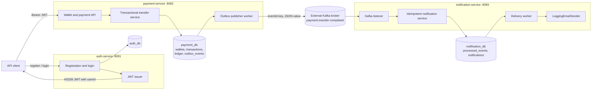
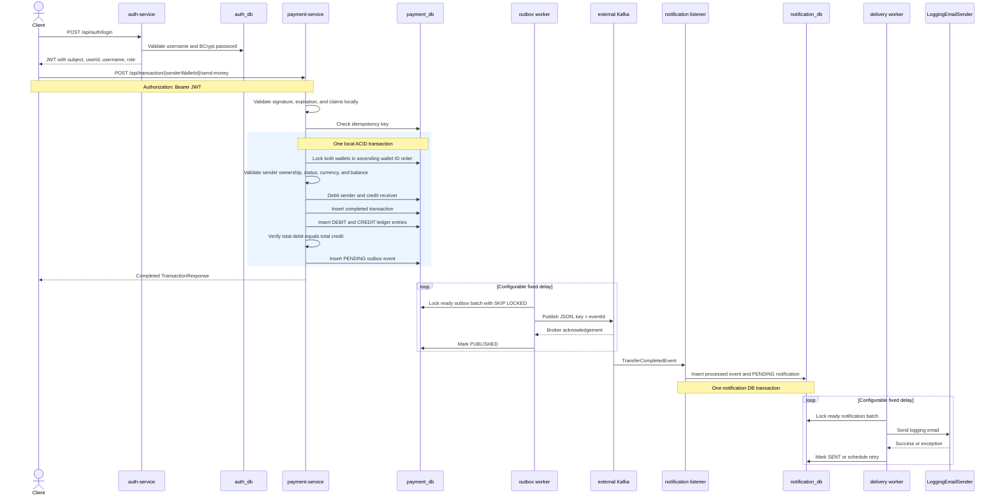

# PayFlow

PayFlow is a learning-focused, multi-service wallet and payment backend built around transactional correctness, reliable event delivery, and explicit failure handling.

The project is intentionally more than a CRUD sample. Its main transfer path coordinates wallet ownership checks, deterministic pessimistic locking, balance changes, transaction persistence, double-entry ledger records, and transactional outbox creation in one local database transaction. A background publisher sends committed events to Kafka, and an independent notification service consumes them idempotently and processes delivery retries.

PayFlow is not presented as production-ready banking software. The [Known limitations and future improvements](#known-limitations-and-future-improvements) section documents the remaining gaps.

## Architecture

| Service | Port | Responsibility | Database |
| --- | ---: | --- | --- |
| `auth-service` | `8081` | Registration, login, BCrypt password hashing, JWT creation, user profiles | `auth_db` |
| `payment-service` | `8082` | Wallets, balance mutations, transfers, transaction history, transfer ledger, outbox publishing | `payment_db` |
| `notification-service` | `8083` | Kafka consumption, event deduplication, notification persistence, retryable delivery | `notification_db` |

Each service owns its entities and repositories. Services do not import one another's persistence models and do not query another service's database.



### API flow

1. A client registers or logs in through `auth-service`.
2. The returned JWT contains the subject/username, immutable `userId`, and role.
3. `payment-service` validates the JWT locally using the shared signing secret and creates its own authenticated principal.
4. Controllers pass `principal.userId()` into wallet and transaction operations.
5. No normal payment request calls `auth-service` or queries an auth repository.

### Event flow

1. A successful transfer creates a `TRANSFER_COMPLETED` outbox row inside `payment_db`.
2. The payment outbox worker polls ready `PENDING` rows using `FOR UPDATE SKIP LOCKED`.
3. It publishes the existing JSON payload to `payment.transfer-completed`, using `eventId` as the Kafka message key, and waits for broker acknowledgement.
4. `notification-service` deserializes the payload into its own local `TransferCompletedEvent` DTO.
5. It inserts the processed event marker and notification in one notification-database transaction.
6. A separate delivery worker sends the notification through `LoggingEmailSender` and updates retry state.

The current event contract is:

```json
{
  "eventId": "550e8400-e29b-41d4-a716-446655440000",
  "transactionId": 100,
  "transactionRef": "TX-100",
  "senderWalletId": 1,
  "receiverWalletId": 2,
  "senderUserId": 10,
  "amount": 25.00,
  "currency": "TL",
  "occurredAt": "2026-07-30T20:00:00"
}
```

## Core transaction flow

The following sequence describes `POST /api/transaction/{walletId}/send-money`.



The lock order uses the lower wallet ID first and the higher wallet ID second. This makes competing transfers acquire locks consistently and reduces deadlock risk.

## Reliability guarantees

### Local ACID transaction boundary

For a wallet-to-wallet transfer, these operations share one `payment_db` transaction:

- sender balance update;
- receiver balance update;
- completed transaction insert;
- debit and credit ledger inserts;
- ledger balance validation;
- pending outbox insert.

If ledger validation, ledger persistence, or outbox serialization/persistence fails, the transfer transaction rolls back. Wallet balances, transaction, ledger, and outbox cannot partially commit within this local boundary.

### Idempotent HTTP mutation requests

`add-money` and `send-money` require an `idempotencyKey`. The `transactions` table has a unique constraint on that key, and a repeated request returns the existing transaction instead of repeating the mutation.

The current key is globally scoped rather than scoped by user or endpoint. Clients should generate high-entropy unique keys, such as UUIDs.

### Pessimistic wallet locking

Transfers use `PESSIMISTIC_WRITE` locks. Both wallet IDs are sorted before acquisition, so concurrent operations involving the same pair follow the same lock order. A competing transfer waits for the lock holder and then evaluates the committed balance.

### Balanced transfer ledger

Each wallet-to-wallet transfer creates:

- one `DEBIT` entry for the sender;
- one equal `CREDIT` entry for the receiver.

The service validates that total debit equals total credit before saving the entries. Ledger records also capture wallet IDs, currency, and balances before and after the transfer.

This is currently a transfer ledger, not a complete accounting system: `add-money` does not yet create a corresponding system-account ledger entry.

### Transactional outbox

PayFlow does not perform a database write followed by a direct Kafka write in the HTTP transaction. Instead, it commits the domain changes and a `PENDING` outbox row atomically. A scheduled worker later publishes committed rows.

Ready outbox rows are selected oldest-first with:

```sql
SELECT *
FROM outbox_events
WHERE status = 'PENDING'
  AND next_attempt_at <= CURRENT_TIMESTAMP
ORDER BY created_at ASC
LIMIT :batchSize
FOR UPDATE SKIP LOCKED
```

This allows multiple publisher instances to avoid selecting the same locked row. In the current implementation, the database lock remains open while waiting for Kafka acknowledgement.

### Retry and exponential backoff

Outbox publishing and notification delivery both:

- increment `retryCount` after a failure;
- store a safe, truncated error message;
- calculate exponential retry delays;
- keep processing later records in the same batch;
- mark the record `FAILED` after the configured retry limit.

### At-least-once delivery and idempotent consumption

PayFlow claims at-least-once event delivery, not exactly-once delivery.

If Kafka acknowledges a publish but the database transaction that marks the outbox row `PUBLISHED` fails, the row remains eligible and can be published again. Likewise, a notification can be stored successfully before the Kafka consumer offset is committed, causing Kafka to redeliver the event.

`notification-service` handles this with:

- an `eventId` unique constraint in `processed_events`;
- an additional unique `eventId` constraint on notifications;
- a duplicate check before notification creation;
- processed-event insertion and notification insertion in the same database transaction.

Exactly-once is not claimed because PostgreSQL state, Kafka broker state, consumer offsets, and an external delivery side effect are not committed by one distributed transaction. Kafka transactions are also not enabled in the current configuration.

## Failure scenarios

| Scenario | Current behavior |
| --- | --- |
| Concurrent transfers target the same wallet | `PESSIMISTIC_WRITE` serializes access. The later transfer reads the balance after the first transaction commits and is revalidated. |
| Ledger validation or persistence fails | The transfer's local transaction rolls back balances, transaction data, ledger writes, and outbox creation. |
| Kafka is unavailable | The HTTP transfer is already safely committed with a `PENDING` outbox row. The publisher increments retry state and applies exponential backoff; it marks the event `FAILED` at the retry limit. |
| Kafka acknowledges, but the outbox status update cannot commit | The row can remain `PENDING` and be published again. Consumers must deduplicate by `eventId`. |
| The same Kafka event is delivered twice | The processed-event unique constraint and transactional duplicate check prevent a second notification row. A concurrent unique-key race can fail and be safely redelivered. |
| Notification delivery fails repeatedly | Retry count and `nextAttemptAt` are updated with exponential backoff. The notification becomes `FAILED` at the retry limit; other notifications in the batch continue. |
| Email delivery succeeds, but its status update fails | A later attempt can send the email again. The current delivery boundary is at-least-once. |

## Service responsibilities and database ownership

### auth-service

Owns:

- `users`
- username and email uniqueness;
- BCrypt password hashes;
- registration and login;
- JWT creation and auth profile lookup.

It does not own wallets or payment records.

### payment-service

Owns:

- `wallets`
- `transactions`
- `ledger`
- `outbox_events`

Wallets, transactions, and ledger remain together because sender debit, receiver credit, transaction history, ledger entries, and outbox creation must commit or roll back together. `userId` is stored as an immutable identity reference, not as a cross-database foreign key.

### notification-service

Owns:

- `processed_events`
- `notifications`

It has a local copy of the event DTO and does not import payment entities. It makes no synchronous call to `auth-service` or `payment-service`.

### Why repositories are not shared

Sharing repositories or entities would let one service bypass another service's ownership and consistency boundary, couple deployments to the same schema, and turn separate services into a distributed monolith. PayFlow communicates identity through signed JWT claims and transfer facts through Kafka events instead.

## Technology stack

Versions below come from the Maven configuration, resolved dependency tree, wrapper, and Compose file.

| Technology | Version / use |
| --- | --- |
| Java | Source and runtime target 17 |
| Spring Boot | 4.1.0 |
| Spring MVC / Security / Data JPA / Validation | Managed by Spring Boot 4.1.0 |
| Spring for Apache Kafka | 4.1.0 |
| Apache Kafka client | 4.2.1 |
| JJWT | 0.13.0 |
| Hibernate ORM | 7.4.1.Final |
| PostgreSQL JDBC driver | 42.7.11 |
| PostgreSQL containers | `postgres:17-alpine` |
| H2 | 2.4.240, tests only |
| Lombok | 1.18.46 |
| Maven Wrapper | Maven 3.9.16, wrapper 3.3.4 |
| Docker / Docker Compose | Local database and service orchestration |

## Running locally

### Prerequisites

- JDK 17 or newer;
- Docker Engine with Docker Compose;
- an externally managed Kafka broker reachable by both payment and notification services;
- `curl`;
- `jq` for the shell examples below, or manual extraction of response fields.

> [!IMPORTANT]
> `compose.yaml` does **not** provision Kafka. It provisions three PostgreSQL containers and the three application containers. Set `KAFKA_BOOTSTRAP_SERVERS` to a broker that already exists. Ensure `payment.transfer-completed` exists or that broker-side topic auto-creation is enabled.

### Environment

Copy the example and replace placeholder values:

```bash
cp .env.example .env
```

For Docker-hosted services talking to a broker on the host, `host.docker.internal:9092` is the provided default. For services started directly on the host, use `localhost:9092` if that is where your broker listens.

Auth and payment must receive the same Base64-encoded HS256 secret. Generate a development secret, for example:

```bash
openssl rand -base64 48 | tr -d '\n'
```

Do not commit the generated value.

### Build everything

Linux/macOS:

```bash
./mvnw clean verify
```

Windows:

```powershell
.\mvnw.cmd clean verify
```

The build produces executable JARs under each module's `target/` directory.

### Option A: databases in Docker, applications on the host

Start only the databases:

```bash
docker compose up -d auth-db payment-db notification-db
```

Set the shared JWT secret and host Kafka address in every terminal that starts a service:

```bash
export JWT_SECRET="<base64-development-secret>"
export KAFKA_BOOTSTRAP_SERVERS="localhost:9092"
```

Start each application in a separate terminal:

```bash
./mvnw -pl auth-service spring-boot:run
```

```bash
./mvnw -pl payment-service spring-boot:run
```

```bash
./mvnw -pl notification-service spring-boot:run
```

Default local database URLs are already configured as:

- `jdbc:postgresql://localhost:5432/auth_db`
- `jdbc:postgresql://localhost:5433/payment_db`
- `jdbc:postgresql://localhost:5434/notification_db`

### Option B: applications and databases in Docker

Build the JARs first because each Dockerfile copies its module artifact:

```bash
./mvnw clean package
docker compose --env-file .env up --build -d
```

The configured Kafka address must be reachable and correctly advertised to containers. Follow logs with:

```bash
docker compose logs -f payment-service notification-service
```

### Exercise the API

The examples create two users because a user can have only one wallet per currency and a transfer requires two distinct wallets with the same currency.

#### 1. Register users

```bash
curl -s -X POST http://localhost:8081/api/auth/register \
  -H "Content-Type: application/json" \
  -d '{
    "username": "alice",
    "email": "alice@example.com",
    "password": "secret1"
  }'
```

```bash
curl -s -X POST http://localhost:8081/api/auth/register \
  -H "Content-Type: application/json" \
  -d '{
    "username": "bob",
    "email": "bob@example.com",
    "password": "secret1"
  }'
```

#### 2. Log in

```bash
ALICE_TOKEN=$(
  curl -s -X POST http://localhost:8081/api/auth/login \
    -H "Content-Type: application/json" \
    -d '{"username":"alice","password":"secret1"}' |
  jq -r '.token'
)

BOB_TOKEN=$(
  curl -s -X POST http://localhost:8081/api/auth/login \
    -H "Content-Type: application/json" \
    -d '{"username":"bob","password":"secret1"}' |
  jq -r '.token'
)
```

#### 3. Create TL wallets

The request body does not need a `userId`; payment-service takes identity from the JWT.

```bash
ALICE_WALLET_ID=$(
  curl -s -X POST http://localhost:8082/api/wallet/create \
    -H "Authorization: Bearer $ALICE_TOKEN" \
    -H "Content-Type: application/json" \
    -d '{"currency":"TL"}' |
  jq -r '.id'
)

BOB_WALLET_ID=$(
  curl -s -X POST http://localhost:8082/api/wallet/create \
    -H "Authorization: Bearer $BOB_TOKEN" \
    -H "Content-Type: application/json" \
    -d '{"currency":"TL"}' |
  jq -r '.id'
)
```

List Alice's wallets:

```bash
curl -s http://localhost:8082/api/wallet \
  -H "Authorization: Bearer $ALICE_TOKEN" | jq
```

#### 4. Add money

```bash
curl -s -X POST \
  "http://localhost:8082/api/transaction/$ALICE_WALLET_ID/add-money" \
  -H "Authorization: Bearer $ALICE_TOKEN" \
  -H "Content-Type: application/json" \
  -d '{
    "amount": 100.00,
    "description": "Development top-up",
    "idempotencyKey": "topup-alice-001"
  }' | jq
```

`add-money` is a development funding endpoint. It updates the wallet and transaction table but currently does not create a balanced ledger entry against a system account.

#### 5. Transfer money

```bash
TRANSFER_ID=$(
  curl -s -X POST \
    "http://localhost:8082/api/transaction/$ALICE_WALLET_ID/send-money" \
    -H "Authorization: Bearer $ALICE_TOKEN" \
    -H "Content-Type: application/json" \
    -d "{
      \"receiverWalletId\": $BOB_WALLET_ID,
      \"amount\": 25.00,
      \"description\": \"Dinner split\",
      \"idempotencyKey\": \"transfer-alice-bob-001\"
    }" |
  jq -r '.id'
)
```

Repeat the exact request with the same idempotency key to receive the existing transaction instead of debiting again.

#### 6. View transaction history

```bash
curl -s \
  "http://localhost:8082/api/transaction/wallets/$ALICE_WALLET_ID/history?page=0&size=20" \
  -H "Authorization: Bearer $ALICE_TOKEN" | jq
```

Fetch the transaction:

```bash
curl -s "http://localhost:8082/api/transaction/$TRANSFER_ID" \
  -H "Authorization: Bearer $ALICE_TOKEN" | jq
```

#### 7. View ledger history

Wallet ledger, paginated and newest-first:

```bash
curl -s \
  "http://localhost:8082/api/wallets/$ALICE_WALLET_ID/ledger?page=0&size=20" \
  -H "Authorization: Bearer $ALICE_TOKEN" | jq
```

Both debit and credit entries for the transfer:

```bash
curl -s \
  "http://localhost:8082/api/ledger/transactions/$TRANSFER_ID" \
  -H "Authorization: Bearer $ALICE_TOKEN" | jq
```

The wallet-ledger endpoint verifies wallet ownership. The transaction-ledger endpoint permits access when the authenticated user owns at least one wallet involved in the transfer.

#### 8. Observe notification delivery

There is no notification CRUD API. Observe the logging sender:

```bash
docker compose logs -f notification-service
```

The current recipient is a placeholder derived from `senderUserId`, such as `user-10@payflow.local`. No real email is sent.

## Testing

Run the complete reactor:

```bash
./mvnw clean verify
```

Run modules independently:

```bash
./mvnw -pl auth-service clean verify
./mvnw -pl payment-service clean verify
./mvnw -pl notification-service clean verify
```

Important coverage includes:

- JWT generation with `userId`, username, and role claims;
- local payment JWT validation and authenticated-principal construction;
- wallet ownership and idempotent transfer behavior;
- wallet-ledger ownership, debit/credit retrieval, pagination, and newest-first ordering;
- ledger failure rolling back the transfer and outbox;
- outbox serialization failure rolling back the transfer;
- ready/future outbox selection, successful publish state, retry scheduling, terminal failure, and batch continuation;
- event-contract deserialization in notification-service;
- first and duplicate notification events;
- notification success, retry, terminal failure, and batch continuation;
- persistence failure rolling back both processed-event and notification rows.

These are component/integration-style Spring tests, not full end-to-end environment tests:

- persistence tests use H2 in PostgreSQL compatibility mode;
- Kafka publishing tests mock `KafkaTemplate`;
- notification tests do not run a real Kafka broker;
- notification delivery tests mock `EmailSender`;
- no Testcontainers PostgreSQL/Kafka suite currently exists.

## Repository structure

```text
payflow-platform/
├── pom.xml
├── compose.yaml
├── .env.example
├── auth-service/
│   ├── pom.xml
│   ├── Dockerfile
│   └── src/
├── payment-service/
│   ├── pom.xml
│   ├── Dockerfile
│   └── src/
├── notification-service/
│   ├── pom.xml
│   ├── Dockerfile
│   └── src/
└── .mvn/
```

The root POM is both the parent and aggregator for all three executable Spring Boot applications.

## Design decisions

### Why carry userId in the JWT?

Username is useful for display and login, but payment ownership is keyed by an immutable numeric user identity. Carrying signed `userId`, username, and role claims lets payment-service validate identity locally without querying `auth_db` or making a synchronous auth request for every operation.

Authentication still does not prove resource ownership. Every wallet mutation must separately verify that the requested wallet belongs to `principal.userId()`.

### Why keep wallet, transaction, and ledger together?

A transfer is one consistency operation. The sender debit, receiver credit, transaction record, ledger evidence, and outbox intent must either all commit or all roll back. Keeping them in `payment_db` gives the transfer one local ACID boundary.

### Why are debit and credit not separate microservices?

Splitting debit and credit would turn one atomic balance movement into a distributed workflow with intermediate states, compensation, and reconciliation requirements. The current design prioritizes correctness over service-count purity.

### Why use an outbox instead of database plus Kafka dual writes?

PostgreSQL and Kafka cannot normally participate in one simple local transaction. Directly writing the database and then publishing can lose events after a crash; publishing first can expose events for database work that later rolls back. The outbox stores the event intent beside the domain update and retries publication after commit.

### Why is notification delivery asynchronous?

Email delivery is slower and less reliable than the payment database transaction. Moving it behind Kafka keeps external-delivery failures out of the money movement path and allows independent retries without holding the HTTP request open.

## CV-ready project summary

- Built a Spring Boot multi-service wallet backend with local JWT validation, wallet-mutation ownership enforcement, deterministic pessimistic locking, HTTP idempotency, and atomic sender/receiver balance updates.
- Implemented transfer-level double-entry ledger validation and a PostgreSQL transactional outbox with Kafka publishing, acknowledgement handling, `SKIP LOCKED` batching, and exponential retry.
- Developed an idempotent Kafka notification consumer with transactional deduplication, independent database ownership, retryable asynchronous delivery, and rollback-focused tests.

## Learning Project and AI Usage

PayFlow was built primarily as a self-learning project focused on backend engineering, fintech systems, distributed systems, and failure handling.

AI coding tools were used selectively for:

- repetitive boilerplate;
- moving code during the monolith-to-microservices migration;
- generating initial test scaffolding;
- mechanical CRUD-style components;
- documentation assistance.

The following areas were studied, designed, reviewed, and manually reasoned about by the author:

- service boundaries;
- JWT identity propagation between services;
- pessimistic locking and deadlock prevention;
- HTTP idempotency;
- double-entry ledger design;
- transactional outbox;
- Kafka producer and consumer transactions;
- consumer offsets;
- at-least-once delivery;
- idempotent consumers;
- retry and exponential backoff;
- notification delivery failure handling.

Kafka producer/consumer transactions were studied as part of evaluating delivery models; the current implementation uses a PostgreSQL outbox, broker acknowledgements, and idempotent consumption rather than configured Kafka transactions or an exactly-once claim.

The project is not presented as having been written without AI. Every generated change was inspected, tested, and understood before being accepted; generated code was not treated as independently authored without review.

## What I Learned

- Authentication proves who made a request; it does not prove that the requested wallet belongs to that identity.
- Immutable identity data such as `userId` can be carried through signed JWT claims so downstream services can authenticate locally.
- Sender debit and receiver credit must remain inside one local consistency boundary.
- Wallet balances alone are current state, not a reliable or explainable financial history.
- Double-entry ledger records explain balance changes and allow debit/credit validation.
- A database write and Kafka publish cannot normally be committed as one ordinary local transaction.
- A transactional outbox prevents a committed business transaction from silently losing its event intent.
- Outbox delivery is generally at-least-once because a broker acknowledgement and database status update can fail independently.
- Consumers must be idempotent because redelivery is a normal recovery behavior.
- Kafka offsets represent consumer-group progress through each topic partition, not proof that an external side effect occurred exactly once.
- Retries require backoff so a temporary dependency failure does not create a tight failure loop.
- Microservices should not share repositories, persistence entities, or databases because doing so breaks ownership and independent evolution.

## Learning Resources

- [Microsoft Azure Architecture Center — Transactional Outbox Pattern](https://learn.microsoft.com/en-us/azure/architecture/databases/guide/transactional-out-box-cosmos)  
  A practical explanation of persisting business state and event intent together, then publishing asynchronously.
- [Spring Blog — Producer-Initiated Transactions in Spring Cloud Stream Kafka Applications](https://spring.io/blog/2023/09/28/producer-initiated-transactions-in-spring-cloud-stream-kafka-applications)  
  Useful for comparing Kafka-coordinated transaction approaches with the explicit database outbox used here.
- [Spring Blog — A Use Case for Transactions: Adapting to Transactional Outbox Pattern](https://spring.io/blog/2023/10/24/a-use-case-for-transactions-adapting-to-transactional-outbox-pattern/)  
  Discusses outbox trade-offs and alternative Spring/Kafka transaction strategies.
- [Spring for Apache Kafka 4.1 — Transactions](https://docs.spring.io/spring-kafka/reference/kafka/transactions.html)  
  Official transaction-manager and transactional producer documentation for the Spring Kafka version resolved by this project.
- [Spring for Apache Kafka 4.1 — Exactly Once Semantics](https://docs.spring.io/spring-kafka/reference/kafka/exactly-once.html)  
  Defines the narrower Kafka read-process-write EOS model and why it does not automatically make external database or email side effects exactly once.
- [Apache Kafka 4.2 — Design: consumer position, delivery semantics, and transactions](https://kafka.apache.org/42/design/design/)  
  Official background on offsets, at-most/at-least/exactly-once semantics, and transactional processing.
- [Apache Kafka 4.2 — Consumer configuration](https://kafka.apache.org/42/configuration/consumer-configs/)  
  Official definitions for consumer-group settings, offset behavior, auto-commit, and `isolation.level=read_committed`.
- [Apache Kafka 4.2 — Transaction Protocol](https://kafka.apache.org/42/operations/transaction-protocol/)  
  Describes the broker-side transaction protocol used by Kafka 4.x clients when Kafka transactions are enabled.

## Known limitations and future improvements

- Compose provisions PostgreSQL only; an external Kafka broker and topic are required.
- Tests use H2 and mocked Kafka/email boundaries rather than Testcontainers with real PostgreSQL and Kafka.
- `LoggingEmailSender` does not send real email, and recipients are placeholder addresses derived from `senderUserId`.
- `add-money` creates funds without a system-account debit and does not write double-entry ledger records.
- `GET /api/transaction/{transactionId}` and wallet transaction history are authenticated but currently do not enforce the same ownership validation as wallet and ledger reads.
- HTTP idempotency keys are globally unique instead of scoped by user and operation.
- JWTs use a shared HS256 secret; asymmetric signing and key rotation are not implemented.
- JPA uses `ddl-auto=update`; versioned database migrations are not yet present.
- Outbox and notification workers keep database locks open while waiting for external acknowledgement/delivery.
- `FAILED` outbox and notification records have no cleanup, replay, or operational recovery endpoint.
- No API Gateway, centralized rate limiting, or service discovery is included.
- Distributed tracing, metrics, dashboards, and alerting are not implemented.
- Kafka DLQ handling and malformed-event operational recovery are not implemented.
- A real email provider, recipient/contact snapshot in the event contract, templates, and preferences remain future work.
